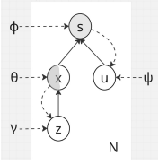

# Extending not-MIWAE for Correlated MNAR Mechanisms

[](https://www.python.org/downloads/)
[](https://www.tensorflow.org/)
[](https://opensource.org/licenses/MIT)

This repository extends the [not-MIWAE framework](https://arxiv.org/abs/2006.12871) to handle **correlated missing data patterns** in MNAR (Missing Not At Random) scenarios. Real-world missingness often exhibits structured dependencies that violate standard independence assumptions.

## Problem Statement

Standard not-MIWAE assumes conditional independence between mask variables:

$$p_\phi(s|x) = \prod_{j=1}^{p} \text{Bern}(s_j | \pi_{\phi,j}(x))$$

This fails when:
-  Survey questions have skip logic
-  Medical tests are paired (one missing → others missing)  
-  Data collection follows systematic protocols

## Our Solution

We introduce a **latent regime variable** $u \sim \mathcal{N}(0, I)$ to capture structured dependencies:

$$p_{\theta,\phi}(x, s, z, u) = p_\phi(s|x, u) \cdot p_\theta(x|z) \cdot p(z) \cdot p(u)$$

<p align="center">
  
</p>

### Architecture Variants

Three ways to combine data $x$ and regime $u$:

| Architecture | Formula | Best For |
|-------------|---------|----------|
| **Concatenation** | $\pi([x,u]) = \sigma(\text{MLP}([x,u]))$ | Non-linear interactions |
| **Additive** | $\pi(x,u) = \sigma(\text{MLP}_x(x) + \text{MLP}_u(u))$ | Linear regime effects |
| **Multiplicative** | $\pi(x,u) = \sigma(\text{MLP}_x(x) \times \text{MLP}_u(u))$ | Modulation effects |

## List of Files

1. `notMIWAE_extended.py`: Extended not-MIWAE model with regime variable
2. `notMIWAE_base.py`: Baseline not-MIWAE implementation
3. `create_correlated_mnar.py`: Generate correlated MNAR mechanisms
4. `train.py`: Training script with hyperparameter configuration
5. `evaluate.py`: Evaluation and visualization utilities

## Features

- **Regime Encoders**: Full encoder $q_\psi(u|x^o,s)$ and mask-only $q_\psi(u|s)$
- **Multiple Architectures**: Concatenation, additive, and multiplicative variants
- **Correlated MNAR Generation**: Tools to create realistic correlated missingness
- **Importance Sampling**: Extended IWAE bound with dual proposals
- **Comprehensive Evaluation**: RMSE, training curves, regime recovery analysis
- **Visualization Tools**: Loss decomposition, latent space exploration


### Requirements
```
tensorflow>=2.8.0
tensorflow-probability>=0.16.0
numpy>=1.21.0
pandas>=1.3.0
scikit-learn>=1.0.0
matplotlib>=3.5.0
```


## Dataset Structure
```
data/
├── banknote/
│   ├── train.csv
│   └── test.csv
├── concrete/
├── wine_red/
├── wine_white/
└── breast/
```

Datasets from [UCI Machine Learning Repository](https://archive.ics.uci.edu/ml/index.php)

## Experimental Results

### Main Results (100k iterations, full encoder)

| Dataset | not-MIWAE | **not-MIWAE+ (concat)** | Improvement |
|---------|-----------|------------------------|-------------|
| Banknote | 0.81 ± 0.00 | **0.76 ± 0.00** | **6.2%** ↓ |
| Concrete | 1.27 ± 0.47 | **1.19 ± 0.43** | **6.3%** ↓ |
| Red Wine | 1.19 ± 0.40 | **1.18 ± 0.35** | **0.8%** ↓ |
| White Wine | 1.24 ± 0.35 | **1.20 ± 0.31** | **3.2%** ↓ |
| Breast | 1.01 ± 0.00 | **0.92 ± 0.00** | **8.9%** ↓ |

*Values are imputation RMSE (mean ± std). Lower is better.*

### Training Dynamics

**Key Finding**: Extended model requires 50k-100k iterations to converge, but then significantly outperforms baseline.

### Encoder Comparison

| Encoder Type | Banknote | Concrete | Average |
|--------------|----------|----------|---------|
| Full $q(u\|x,s)$ | **0.76** | **1.19** | ** Best** |
| Mask-only $q(u\|s)$ | 1.41 | 1.47 |  Worse than baseline |

**Conclusion**: Using both data and mask in regime encoder is crucial.

### Architecture Comparison

<p align="center">
  
</p>

- **Concatenation**: Best for 4/5 datasets
- **Additive**: Optimal for Breast dataset  
- **Multiplicative**: High variance, less stable

## Running Tests
```bash
# Run all UCI experiments
python experiments/uci_experiments.py --max_iter 100000

# Specific dataset and architecture
python train.py --dataset banknote --architecture concat --encoder_type full

# Ablation studies
python experiments/ablation_encoder.py
python experiments/ablation_architecture.py
```

## Authors

**Mathéo Kina** and **Yee-Yang Hsieh**  
MVA 2025/2026 - ENS Paris-Saclay  

## References

- Ipsen et al. (2021). [not-MIWAE: Deep generative modelling with missing not at random data](https://arxiv.org/abs/2006.12871). ICLR.
- Mattei & Frellsen (2019). [MIWAE: Deep generative modelling and imputation of incomplete data](https://arxiv.org/abs/1812.02633). ICML.
- Burda et al. (2016). [Importance Weighted Autoencoders](https://arxiv.org/abs/1509.00519). ICLR.

---

<p align="center">
  <b>⭐ Star this repo if you find it useful! ⭐</b>
</p>
